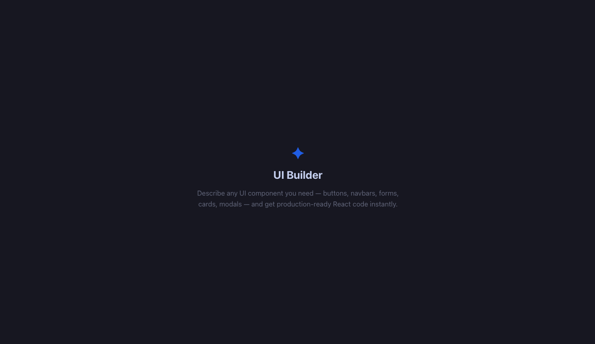
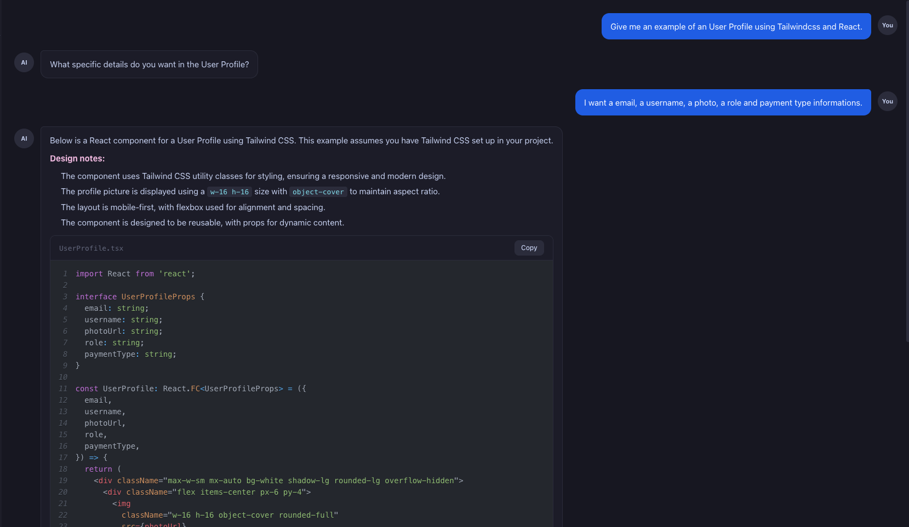

# ✦ UI Builder

AI-powered chat interface that generates production-ready React + TypeScript components from natural language descriptions.



---

## Overview

UI Builder is a full-stack application that lets you describe any UI component in plain English and instantly receive clean, ready-to-use React code. The AI asks targeted clarifying questions when your request is vague, then generates the component once it has enough context.



---

## Features

- **Conversational code generation** — describe a component in natural language and get TypeScript/React code back
- **Smart clarification** — the AI asks up to 2 targeted questions before generating when the request is ambiguous
- **Multi-turn memory** — full conversation history is preserved per session, enabling iterative refinement ("make it wider", "add a footer")
- **Syntax-highlighted previews** — generated code is rendered in a code block with line numbers and a one-click copy button
- **Session management** — create, switch between, and delete chat sessions from the sidebar
- **Dark theme** — Catppuccin Mocha palette via CSS custom properties

---

## Tech Stack

### Backend
- **Django 6** + **Django REST Framework** — REST API with `SessionViewSet` and a nested `messages` action
- **LangChain** + **GPT-4o** — multi-turn chain with system prompt, few-shot examples, and sliding-window token management
- **GPT-4o-mini** — lightweight classifier that decides whether to ask a clarifying question or generate immediately
- **SQLite** (dev) / **PostgreSQL** (prod)

### Frontend
- **React 19** + **TypeScript** + **Vite**
- **Tailwind CSS v4** + **shadcn/ui** — design system built on Catppuccin Mocha tokens
- **Axios** — typed API client
- **react-syntax-highlighter** — code block rendering

---

## Project Structure

```
ui-app/
├── assets/                         # Screenshots used in this README
├── backend/
│   ├── chat/
│   │   ├── ai/
│   │   │   ├── chain.py            # UIGeneratorChain (LangChain pipeline)
│   │   │   ├── classifier.py       # GPT-4o-mini request classifier
│   │   │   ├── output_parser.py    # Fenced code block extractor
│   │   │   ├── prompts.py          # System prompt + few-shot examples
│   │   │   └── token_manager.py    # Sliding-window history trimmer
│   │   ├── models.py               # Session + Message models
│   │   ├── serializers.py
│   │   ├── views.py                # SessionViewSet
│   │   └── urls.py
│   └── config/
│       └── settings/
│           ├── base.py             # Shared settings
│           ├── dev.py              # Development overrides (SQLite, DEBUG=True)
│           └── prod.py             # Production overrides (PostgreSQL, HTTPS)
└── frontend/
    └── src/
        ├── app.tsx                 # Root shell
        ├── core/                   # Shared infrastructure (shadcn ui, lib, stubs)
        └── modules/
            └── chat/
                ├── components/     # sidebar, chat-window, message-list, …
                ├── hooks/          # use-chat.ts
                ├── pages/          # chat-page.tsx (entrypoint)
                ├── service/        # chat-service.ts (Axios client)
                └── types/          # chat.ts (TypeScript interfaces)
```

---

## Getting Started

### Prerequisites

- Python 3.11+
- Node.js 20+
- An [OpenAI API key](https://platform.openai.com/api-keys)

### Backend

```bash
cd backend

# Create and activate a virtual environment
python -m venv .venv
source .venv/bin/activate        # Windows: .venv\Scripts\activate

# Install dependencies
pip install -r requirements.txt

# Configure environment variables
cp .env.example .env
# Edit .env and set OPENAI_API_KEY and DJANGO_SECRET_KEY

# Run migrations
python manage.py migrate

# Start the development server
python manage.py runserver
```

The API will be available at `http://localhost:8000/api/`.

### Frontend

```bash
cd frontend

npm install
npm run dev
```

The app will be available at `http://localhost:5173`. The Vite dev server proxies `/api` requests to the Django backend automatically.

---

## Environment Variables

Create a `.env` file in the `backend/` directory:

```env
DJANGO_SECRET_KEY=your-secret-key-here
OPENAI_API_KEY=sk-...
DEBUG=True
```

---

## API Reference

| Method | Endpoint | Description |
|--------|----------|-------------|
| `GET` | `/api/sessions/` | List all sessions |
| `POST` | `/api/sessions/` | Create a new session |
| `GET` | `/api/sessions/:id/` | Get session with messages |
| `DELETE` | `/api/sessions/:id/` | Delete a session |
| `GET` | `/api/sessions/:id/messages/` | List messages in a session |
| `POST` | `/api/sessions/:id/messages/` | Send a message and get AI response |

The `POST /messages/` response includes:

```json
{
  "id": "uuid",
  "role": "assistant",
  "content": "Here is your component...",
  "code_blocks": [{ "language": "tsx", "filename": "Button.tsx", "code": "..." }],
  "action": "generate",
  "questions": [],
  "created_at": "2026-01-01T00:00:00Z"
}
```

When the AI needs clarification, `action` is `"ask"` and `content` contains the question.
